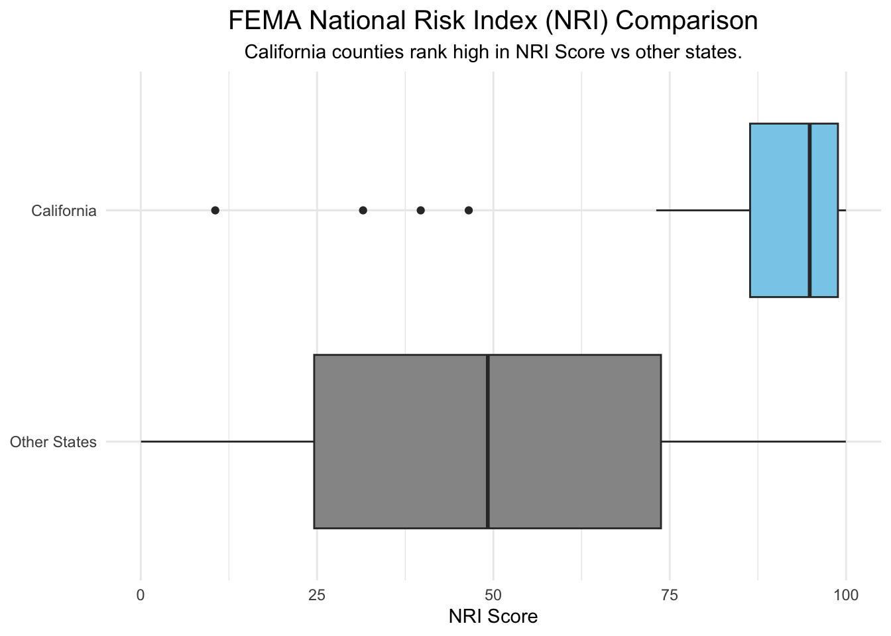

# EDS 240: Homework #2 & #3 (Visualizing FEMA NRI Data)

This repository contains the materials for EDS 240 - Data Visualization: Homework 2 & 3, which seek to answer the following questions with data visualizations:

-   **HW #2:** *How do FEMA National Risk Index (NRI) scores for counties in California compare to those in other states?*

-   **HW #3:** *How does climate hazard risk exposure vary across race demographics in California?*

## Data

-   NRI Data: Retrived from the [FEMA Resilience Analysis and Planning Tool.](https://www.fema.gov/emergency-managers/practitioners/resilience-analysis-and-planning-tool) This tool contains more than 100 data layers with weather hazard, infrastructure, and risk information to help state and local officials evaluate their potential challenges in disaster impacts.

-   Census Data:

## Author

Zach Loo